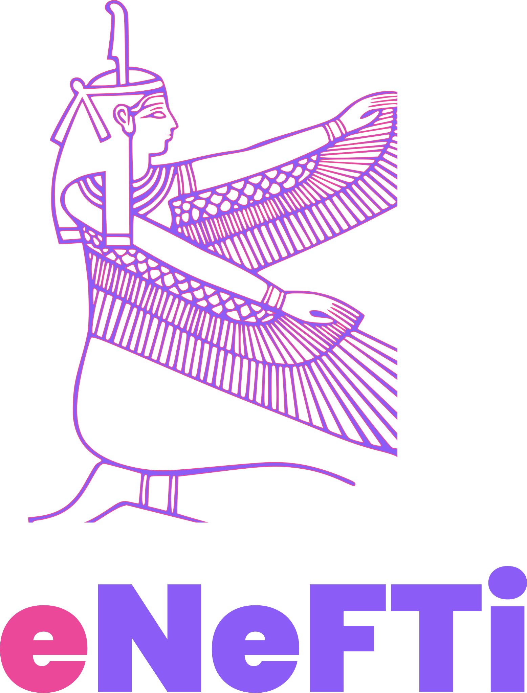
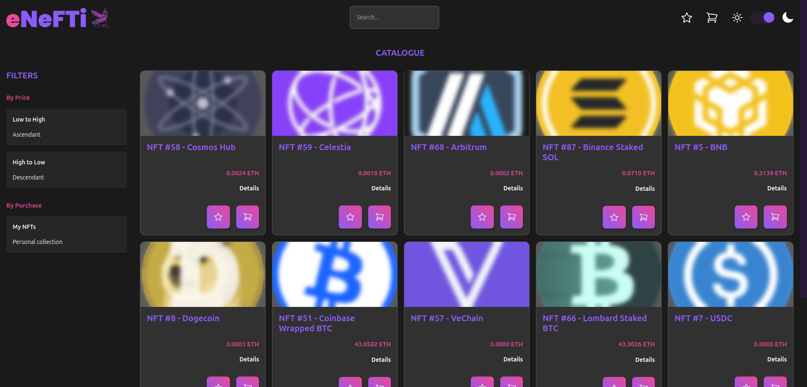

# eNeFTi

NFTs E-Commerce demo.







[](https://github.com/lc-2025/enefti/actions/workflows/ci.yml) [](https://github.com/lc-2025/enefti/actions/workflows/cd.yml)

## About

A full-stack website based on MERN consisting of a NFTs e-commerce for demo purposes.

© LC. All Rights reserved.

## Features

- Catalogue pagination and details displaying
- NFTs filtering by price and ownership
- Products wishlist and cart persistence
- Checkout simulation and storage
- Persisting purchases history
- Token search by name
- Light/Dark theme with system-detection support
- Responsiveness

## Stack

- **Languages**: HTML, CSS, SASS, JavaScript, Typescript, GraphQL, YAML, Bash
- **Environments**: DOM, Node.js
- **Libraries**: Heroicons, Headless UI, Motion, Apollo GraphQL, Testing Library
- **Frameworks**: React, Next.js, TailwindCSS, Express, Jest, Cypress
- **Pre/Post-Processors**: PostCSS, Sass
- **Linters/Plugins**: stylelint, ESLint, Prettier
- **Compilers**: TypeScript
- **Testing**: Jest, Testing Library, Cypress
- **Versioning**: GitHub, Husky
- **Continuous-Integration/Delivery**: GitHub Actions
- **Deployment**: Docker/Compose, Vercel, Render
- **Database**: MongoDB Atlas

## Getting Started

The project production version is available on _Vercel_ at [https://enefti-demo.vercel.app](https://enefti-demo.vercel.app).
For any contribution, maintanance and/or trial needs, please refer to the following specifications and side-ones:

- [Frontend](./frontend/README.md)
- [Backend](./backend/README.md)

## Repository

The project reflects a monolithic setting - monorepo - using _NPM Workspaces_ to organize both frontend than backend sides.
Workspaces may be globally managed accordingly to the following specifications.

## Setting Up

On terminal, from project root:

- To install dependencies for all the workspaces:

```bash
npm run setup
```

- To lint the sources for the `Frontend` workspace:

```bash
npm run lint
```

- To build the production version of all the workspaces:

```bash
npm run build
```

- To run the tests in `testing` mode (staging or content-integration/delivery environments) on all the workspaces:

```bash
npm run test
```
