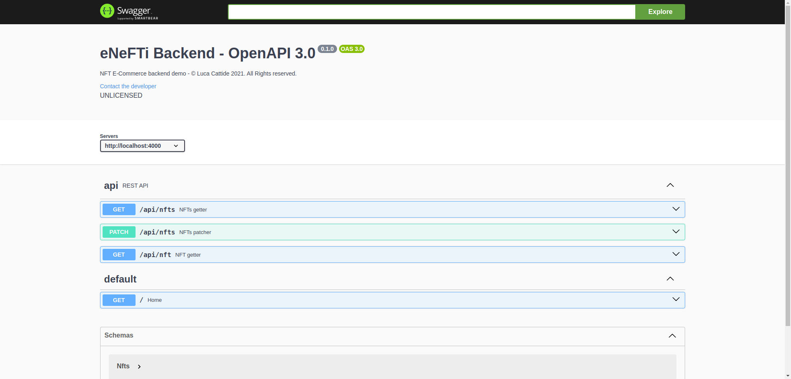
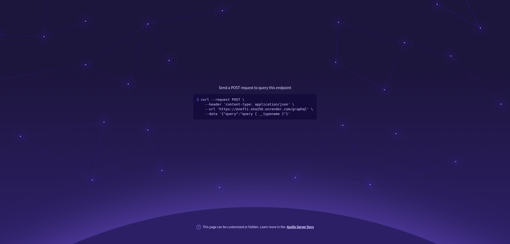

# eNeFTi

NFT e-commerce storefront and digital asset platform built with **Next.js**, **React**, **TypeScript**, **GraphQL**, and **Node.js** in an NPM Workspaces monorepo.

[](https://github.com/lc-2025/enefti/actions/workflows/ci.yml)
[](https://github.com/lc-2025/enefti/actions/workflows/cd.yml)

**Live Demo:** [enefti-demo.vercel.app](https://enefti-demo.vercel.app)
> Please note that the backend services are subject to cold starts. You might experience a little delay on a first run.


---

## Overview

**eNeFTi** is a full-stack digital collectibles storefront enabling users to browse paginated NFT catalogs, filter assets by price and ownership, manage persistent wishlists and shopping carts, and simulate end-to-end checkout flows with persisted purchase history.

### Core Capabilities

- **Catalog Discovery & Filtering:** Browse paginated digital asset listings, inspect token details, search tokens by name, and filter inventory by price range and ownership status.
- **Persistent Cart, Wishlist & Checkout Simulation:** Maintain wishlist and cart state across sessions, execute simulated checkout transactions, and review persisted purchase history in **MongoDB Atlas**.
- **Dual API Layer (GraphQL & REST):** Powered by **Apollo GraphQL** and **Express** to serve structured catalog queries and transactional mutations alongside documented REST endpoints.
- **Adaptive UI & Motion:** Responsive interface built with **Next.js**, **TailwindCSS**, **Headless UI**, and **Motion**, supporting automatic system-detected Light and Dark themes.

---

## Architecture & Tech Stack

The repository is structured as an **NPM Workspaces monorepo** decoupling the Next.js storefront from the containerized GraphQL/REST backend:

```text
enefti/
├── frontend/          # Next.js, React, TypeScript, TailwindCSS, Apollo Client, Motion, Jest, Cypress
├── backend/           # Node.js, Express, TypeScript, Apollo GraphQL, MongoDB Atlas, Jest, Docker
├── docs/              # Documentation assets, brand logo, and preview media
└── .github/workflows/ # Automated CI (lint, unit/E2E tests, build) & CD (Docker -> Render / Vercel)
```

### Engineering Trade-offs

- **Hybrid GraphQL & REST API Architecture:** Combining **Apollo GraphQL** for flexible storefront catalog queries and client-side cache normalization with **Express** REST endpoints provides strict data-fetching efficiency on the UI while preserving straightforward integration and documentation for backend services.
- **End-to-End TypeScript & Code Quality Governance:** Shared TypeScript compilation, ESLint, Prettier, stylelint, and Husky pre-commit hooks enforce consistent code standards across both workspaces before running Jest unit/integration suites and Cypress E2E tests.
- **Decoupled Cloud Deployment:** Automated GitHub Actions CI/CD pipelines validate builds and test suites prior to deploying the frontend storefront to **Vercel** and the containerized backend service via **Docker** to **Render**.

---

## Visual Previews

- **Light Theme:** 
- **Dark Theme:** 
- **REST API Docs:** 
- **GraphQL Playground:** 

---

## Documentation

For workspace-specific environment setup, API schemas, Docker Compose workflows, and testing instructions, refer to the dedicated guides:

- **[Frontend Documentation](./frontend/README.md)** — Next.js storefront, Apollo GraphQL client, theme management, Jest & Cypress E2E.
- **[Backend Documentation](./backend/README.md)** — Express & Apollo GraphQL server, MongoDB Atlas persistence, Docker & Render deployment.

---

## Getting Started

Run all workspace commands from the repository root:

- **Install dependencies across all workspaces:**

```bash
npm run setup
```

- **Run linter and formatting checks:**

```bash
npm run lint
```

- **Execute test suites across all workspaces:**

```bash
npm run test
```

- **Build production bundles for all workspaces:**

```bash
npm run build
```

---

## Copyright & Disclaimer

**All Rights Reserved (`UNLICENSED`).** The source code in this repository is the original work of the author and is published solely for portfolio demonstration and technical evaluation purposes. No license is granted for commercial use, redistribution, or derivative works.

All third-party trademarks, logos, digital asset artwork, and external API references displayed in the application or preview media belong to their respective owners. The author claims no ownership or affiliation with those entities.
